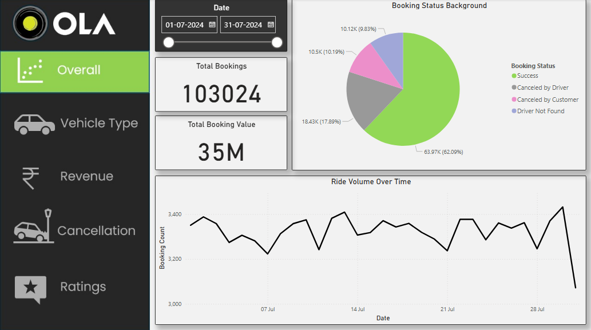
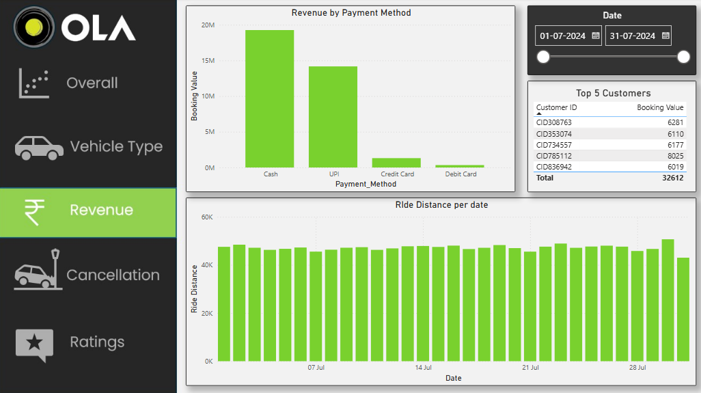
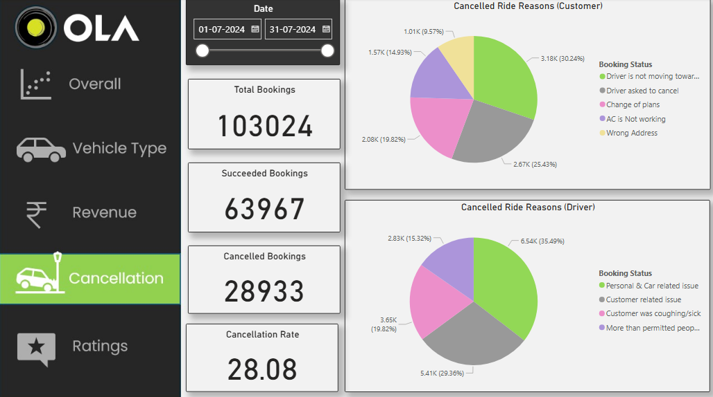

# OLA---Ride-Analysis_SQL_PowerBI

## 1. Project Overview
This project analyzes Ola rides using the data of over 103000 bookings. The goal is to identify the reasons and trend 
of the ride cancellation.

## Data analysis using SQL
I performed structured analysis in MySQL to answer key business questions:
- 1. Retrieve all successful bookings:
```sql
SELECT 
	* 
FROM bookings
WHERE Booking_Status = 'Success';
```
- 2. Find the average ride distance for each vehicle type:
```sql
CREATE VIEW ride_distance_for_each_vehicle AS
SELECT 
	Vehicle_Type,
	AVG(Ride_Distance) 
FROM bookings
GROUP BY Vehicle_Type;
SELECT * FROM ride_distance_for_each_vehicle;
```
- 3. Get the total number of cancelled rides by customers:
```sql
SELECT 
	COUNT(*)
FROM bookings
WHERE Booking_Status = 'Canceled by Customer';
```

- 4. List the top 5 customers who booked the highest number of rides:
```sql
CREATE VIEW top_five_customers AS
SELECT 
	Customer_ID,
	COUNT(Booking_ID) AS total_rides
FROM bookings
GROUP BY Customer_ID
ORDER BY 2 DESC LIMIT 5;
SELECT * FROM top_five_customers;
```

- 5. Get the number of rides cancelled by drivers due to personal and car-related issues:
```sql
SELECT 
	COUNT(*) 
FROM bookings
WHERE Canceled_Rides_By_Driver = 'Personal & Car related issue';
```

- 6. Find the maximum and minimum driver ratings for Prime Sedan bookings:
```sql
SELECT 
	Vehicle_Type,
    MAX(Driver_Ratings) AS max_driver_rating,
    MIN(Driver_Ratings) AS min_driver_rating
FROM bookings
WHERE Vehicle_Type = 'Prime Sedan';
```
 
- 7. Retrieve all rides where payment was made using UPI:
```sql
SELECT 
	*
FROM bookings
WHERE Payment_Method = 'UPI';
```

- 8. Find the average customer rating per vehicle type:
```sql
SELECT 
	Vehicle_Type,
    ROUND(AVG(Customer_Rating), 2) AS avg_customer_rating
FROM bookings
GROUP BY Vehicle_Type;
```

- 9. Calculate the total booking value of rides completed successfully:
```sql
SELECT 
	SUM(Booking_Value) AS successfull_booking_value_total
FROM bookings
WHERE Booking_Status = 'Success';
```

- 10. List all incomplete rides along with the reason:
```sql
SELECT
	Booking_ID,
    Incomplete_Rides_Reason
FROM bookings
WHERE Incomplete_Rides = 'Yes';
```

## Dashboard in Power BI
Finally I built a interactive dashboard using Power BI to present the insights.

i. Overall: This shows the booking status background, how is the trend of the bookings over time. 
 


ii. Revenue by payment mathod: This shows the prefered payment methods by the customers and total value by payment method used.



iii. Cancellation status: This shows the ride cancellation rate and the cancellation reasons.



## Business Insights
- Review driver's ratings - The majority of the rides cancelled by the customers gave driver related reasons. This cancellatons
  						    can be coverted into successfull bookings by adding more high rated drivers
- Car inspection - The majority rides cancelled by driver gave car related problem reason.


